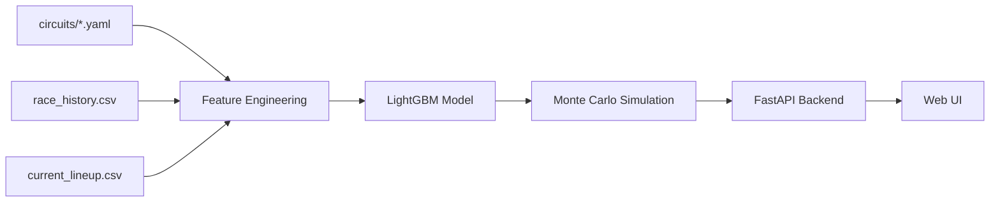

# 🏁 F1 Race Predictor

Predicts the top 3 finishers — and win/podium/points probabilities for the
entire field — for any F1 circuit. Built so that adding a new track, or a
new season of data, never means touching the model code.

## About this

I've been watching F1 for years now, and during my undergrad in mechanical
engineering I was part of the motorsports club, which is where most of my
actual hands-on feel for how a race car behaves came from — long before I
ever thought about modeling it in Python. This project is partly an excuse
to combine those two interests: treating "who's going to be on the podium"
as an engineering problem with real data behind it, instead of just a gut
feeling on a Sunday afternoon.

```
driver_id  predicted_position  win_probability  podium_probability  points_probability
HAM                      2.08            0.397                0.763                0.988
ANT                      3.05            0.287                0.667                0.973
RUS                      3.88            0.201                0.589                0.964
NOR                      6.60            0.053                0.310                0.905
LEC                      7.56            0.030                0.231                0.872
```
*First real output from this pipeline — Austrian GP 2026, trained on 2021–2025 race history pulled via FastF1.*

## How it works

A LightGBM model learns to predict each driver's expected finishing
position from grid position, recent form, team form, and the circuit's
profile — overtaking difficulty, tyre wear severity, safety car odds, rain
probability, and so on. A circuit's profile is just a YAML file; the model
never hardcodes anything about a specific track.

Rather than training separate classifiers for "will they podium," "will
they win," "will they score points," a Monte Carlo simulation runs the
upcoming race thousands of times — adding randomness sampled from the
model's own historical prediction errors — and tallies how often each
driver lands in each outcome. One simulation, every probability, and they
stay consistent with each other instead of contradicting.



## 📋 Race prediction log

A running record of what this thing actually called, race by race —
mostly so I can be honest with myself about how good (or not) it is.

| Race | Stage | Predicted Podium | Actual Podium | Notes |
|------|-------|-------------------|----------------|-------|
| Austrian GP 2026 (Jun 26-28) | Pre-qualifying | 🥇 HAM 🥈 ANT 🥉 RUS | _pending — race weekend hasn't happened yet_ | First live run. Grid position used here is a standings-based stand-in, not real qualifying — expect this to sharpen once Saturday's grid is in. |

### Updating this log each race weekend

1. Refresh `sample_data/current_lineup.csv` — once qualifying happens, swap
   in the real grid order (this is usually the single biggest factor in
   the prediction, so do this before trusting the output).
2. Run the prediction (CLI or the web UI) and copy the top 3 + probabilities
   into a new row above, marked as "Pre-race" or "Post-qualifying" depending
   on when you ran it.
3. After the race, fill in the **Actual Podium** column for that row.
4. Add a blank row for the next circuit on the calendar.

## Project layout

```
circuits/        One YAML file per track — the only thing you touch to
                  add a new circuit or change how it behaves
data/             Raw + processed race history, and the FastF1 fetcher
features/         Combines race history + circuit profile into features
model/            Training, simulation, and prediction logic
backend/          FastAPI app — GET /circuits, GET /predict/{circuit}
frontend/         HTML/CSS/JS UI — circuit diagram, team chips, live predictions
sample_data/      Current grid/form data (update before each race weekend)
```

## Getting started

```bash
git clone <your-repo-url>
cd f1-predictor
python -m venv venv
venv\Scripts\activate        # Windows
source venv/bin/activate     # Mac/Linux
pip install -r requirements.txt
```

**Get historical data** (needs internet access, run outside any sandboxed environment):
```bash
python data/fetchers/fastf1_fetcher.py --start 2021 --end 2025
```
FastF1 rate-limits to 500 calls/hour and derives circuit IDs from event
names (e.g. "Austrian Grand Prix" → `austrian`), so check what came out
and make sure your circuit YAML filenames match exactly.

**Train:**
```bash
python model/train.py
```

**Run the backend:**
```bash
uvicorn backend.main:app --reload
```

**Open the UI:** just open `frontend/index.html` in a browser.

## Adding a new circuit

Copy `circuits/_template.yaml`, rename it to the circuit's id, fill in the
fields. That's it — `/circuits` and `/predict/<id>` work immediately. To
give it a diagram in the UI too, drop a same-named SVG into
`frontend/tracks/`.

## Known limitations

This is trained on a handful of seasons and circuits, not the full F1
history — predictions are directional, not gospel. 2026 also brought the
biggest regulatory overhaul in F1's history (new power units, active
aerodynamics replacing DRS entirely, reduced downforce), so pre-2026 form
data carries real uncertainty about how well it transfers to the current
cars. Treat outputs as "who looks strong" rather than a confident forecast,
especially early in a season with few same-era races to learn from.

## Ideas for extending this

- Pull live weather forecasts instead of each circuit's historical rain probability.
- Add qualifying gap-to-pole as its own feature, separate from grid position.
- Track tyre compound/strategy once stint-level FastF1 data is wired in.
- Add a regulation-era flag so future rule changes don't silently blend with old-era data.

## License

MIT — see [LICENSE](LICENSE).